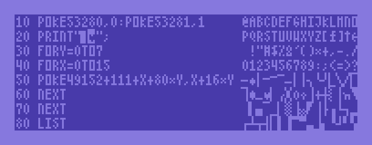
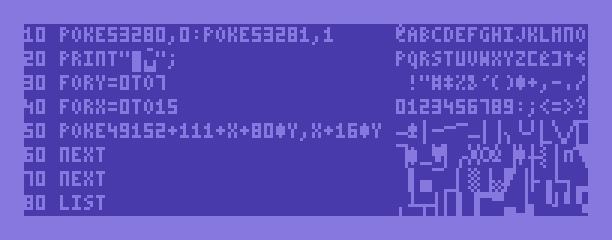
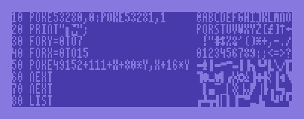
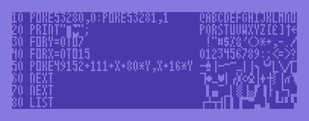

# 80columns

*80columns* is a tool that provides a 80x25 text mode on the Commodore 64 in the KERNAL/BASIC environment. It supports all PETSCII control codes (including color) and is optimized for speed.

The code is based on 80COLUMNS.PRG by an unknown author. It has been reverse-engineered into structured, maintainable code and optimized for speed and size.

## Building

Building requires a UNIX environment and <a href="https://github.com/cc65/cc65">cc65</a> and <a href="https://github.com/bitshifters/exomizer">exomizer</a>. Running <tt>make</tt> will produce <tt>80columns-compressed.prg</tt>, which is about 2.2 KB in size and can be started using <tt>LOAD</tt>/<tt>RUN</tt>.

## Memory Layout

The object code resides at $c800-$cfff. The two character sets are located at $d000-$d7ff. The virtual 80x25 Screen RAM (in order to read back screen contents) is at $c000-$c7ff. The bitmap is at $e000-$ff40, and the color matrix for bitmap mode is at $d800-$dbe8. All this lies beyond the top of BASIC RAM, so BASIC continues to have 38911 bytes free.

## Character Sets

The source contains four character sets (<tt>charset.s</tt>, <tt>charset2.s</tt> etc.) from different 80 column software solutions, which can be selected by changing the reference to the filename in the <tt>Makefile</tt>.

### charset.s: 80COLUMNS

### charset2.s: COLOR 80 by Richvale Telecommunications

### charset3.s: Highspeed80 by CKtwo

### charset4.s: SCREEN-80 by Compute’s Gazette

## Author

Original author unknown. Reverse-engineered and maintained by Michael Steil, mist64@mac.com.

## Contributing

Contributions to this project are very welcome. It would be especially interesting to add new character sets, both existing 4x8 fonts from other projects (including hinted TrueType fonts!), and new ones that combine the respective strengths of the existing ones.

