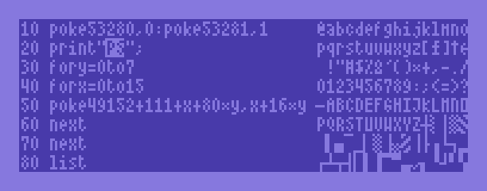
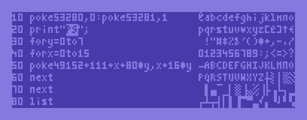
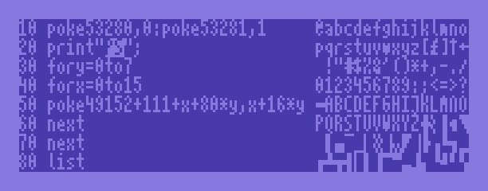
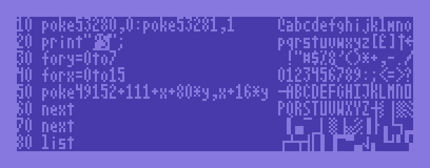

# 80columns

*80columns* is a tool that provides a 80x25 text mode on the Commodore 64 in the KERNAL/BASIC environment. It supports all PETSCII control codes (including color) and is optimized for speed.

The code is based on 80COLUMNS.PRG by an unknown author. It has been reverse-engineered into structured, maintainable code and optimized for speed and size.

## Building

Building requires a UNIX environment and [cc65](https://github.com/cc65/cc65) and [exomizer](https://github.com/bitshifters/exomizer). Running `make` will produce `80columns-compressed.prg`, which is about 2.2 KB in size and can be started using `LOAD`/`RUN`.

## Features

* The meaning of the KERNAL's COLOR variable ($0286/646)  is extended: The low nibble encodes the foreground color, and the high nibble encodes the background color.
* Changing the VIC-II background color by writing to $D021 gets detected. The background color gets applied to the screen, and put into the upper nibble of COLOR.

## Character Sets

The source contains four character sets (`charset.s`, `charset2.s` etc.) from different 80 column software solutions, which can be selected by changing the reference to the filename in the `Makefile`.

You can also `LOAD`/`RUN` a new exomizer-compressed character set into memory, though this destroys the currently-loaded BASIC program.

### charset.s: 80COLUMNS

### charset2.s: COLOR 80 by Richvale Telecommunications

### charset3.s: Highspeed80 by CKtwo

### charset4.s: SCREEN-80 by Compute’s Gazette

## Memory Layout

The object code resides at $c800-$cfff. The two character sets are located at $d000-$d7ff. The virtual 80x25 Screen RAM (in order to read back screen contents) is at $c000-$c7ff. The bitmap is at $e000-$ff40, and the color matrix for bitmap mode is at $d800-$dbe8. All this lies beyond the top of BASIC RAM, so BASIC continues to have 38911 bytes free.

## TODO

* Support LOCK and UNLOCK codes. (On the C64, these are 8 and 9, on the C128 they are 11 and 12...)
* Support C128 codes: BELL (7), TAB (9) etc.
* Support C128 ESC codes
* Support a 80x33 mode as a compile time option.
* Add new character sets:
	* existing 4x8 fonts from other projects (including hinted TrueType fonts!)
	* new ones that combine the respective strengths of the existing ones

## Author

Original author unknown. Reverse-engineered and maintained by Michael Steil, mist64@mac.com.

## Contributing

Contributions to this project are very welcome.